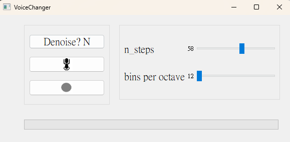

Developed with python 3.10

This readme file is a documentation on what does this man to girl application do and how users can use the GUI

The audio signal are processed in a 1 second interval

this project is created by Yeung Ching Fung and Chan Pak Yin

# UI preview

# Buttons

## Denoise?

This button turns the denoise function on or off

- "Denoise? Y": The data will undergo a denoise function.
- "Denoise? N": No denoising function will be applied.

## Button with a circle

This button controls the voice change on/off, default is off

- Red: The application will start change the pitch in the input signal
- Grey: Input signal will be returned as is.

## Button with mic

This button control the on/off of the mic

- Green: The application will start processing audio streams
- Black: Mic is off and the audio stream received will be ignored

# Slider bars

## n_steps

Multiplier to the pitch, controls how many time the frequency is lifted, if it is 20, the frequencies will become twice, ie 120Hz -> 240Hz

## bins per octave

Adder to the pitch, controls how many frequency level will be added to the lifted voice data, to add more control to the function

# Bottom bar

It indicates that volume level of the processed signal

# References

- [Building a PyQt application to record your microphone and plot its spectrum](https://flothesof.github.io/pyqt-microphone-fft-application.html)
- [Record audio using pyqt5](https://stackoverflow.com/questions/64299359/record-audio-using-pyqt5)
- [Denoising Data with FFT [Python] by Steve Brunton]()
